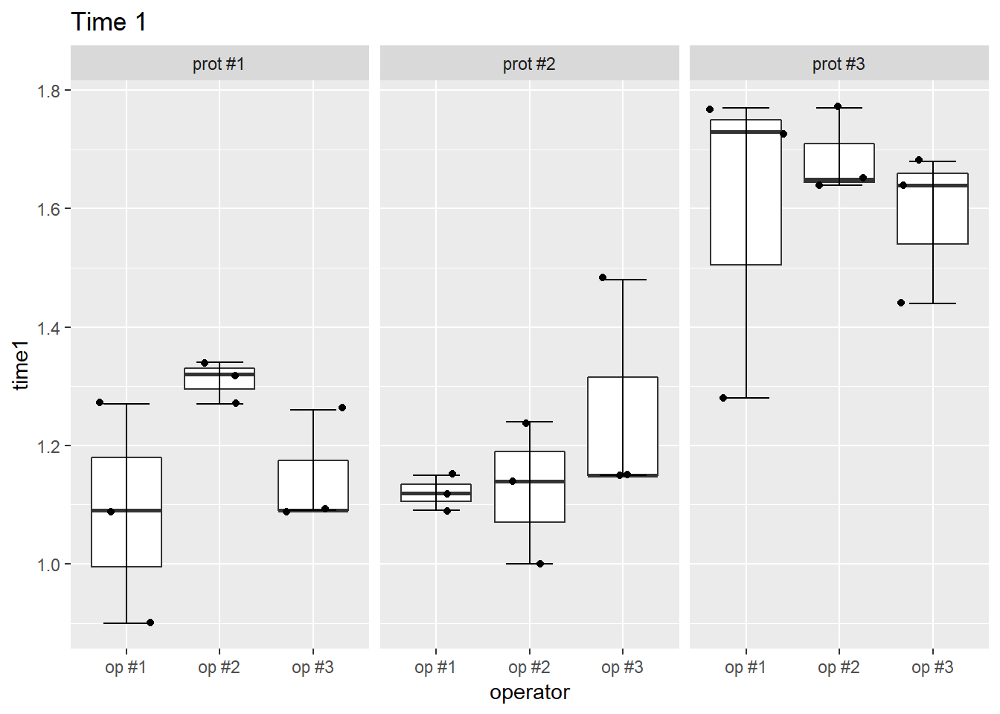

**SixSigma** contains functions and utilities to perform Statistical Analyses in the Six Sigma way.
Through the DMAIC cycle (Define, Measure, Analyze, Improve, Control), you can manage several
Quality Management studies: Gage R&R, Capability Analysis, Control Charts, Loss Function
Analysis, etc.


Authors: Emilio L. Cano, Javier M. Moguerza, Mariano Prieto and Andrés Redchuk


## (I) Load Required Libraries


# 1. climProfile: Compute profile limits

Function to compute prototype profile and confidence bands for a set of profiles (Phase I)


```r
# data: 

# contains 50 profiles corresponding to the density measurments of 50 0.5 in-thick engineered woodboard, measured in 500 locations

head(ss.data.wby)
```

```
##            P1       P2       P3       P4       P5       P6       P7
## [1,] 58.38115 55.07859 58.92000 58.28303 56.60074 51.55817 54.33910
## [2,] 57.99777 54.86589 58.70806 58.01612 56.00993 50.38399 53.37110
## [3,] 58.17090 53.98849 58.62810 57.65936 56.59959 50.54277 54.01407
## [4,] 58.35552 55.05162 58.42878 57.10474 56.25226 50.41126 53.19796
## [5,] 57.92579 53.84910 58.22835 57.49418 55.95592 50.79158 53.85869
## [6,] 57.57768 53.94282 57.02633 57.06341 55.32283 50.45038 52.93769
##            P8       P9      P10      P11      P12      P13      P14
## [1,] 56.73160 54.07844 57.86611 59.14192 57.25379 58.50891 50.30406
## [2,] 57.35277 54.13004 58.12011 57.64937 56.53770 57.85605 50.34676
## [3,] 57.00407 53.53360 57.67520 58.54261 56.20005 57.82964 50.26451
## [4,] 56.23580 53.09884 56.86135 58.72280 56.52328 57.56906 49.73292
## [5,] 56.24521 53.05832 57.64606 57.82216 55.66766 58.16330 49.49982
## [6,] 55.83295 52.74287 56.95209 58.03696 56.27161 58.26631 50.15976
##           P15      P16      P17      P18      P19      P20      P21
## [1,] 54.67521 54.42879 57.11126 55.60908 50.68637 54.83998 59.17506
## [2,] 54.80540 54.38052 56.83029 55.71846 50.13559 54.00201 59.16792
## [3,] 54.45470 54.06602 57.03283 56.48203 50.72783 54.47729 58.11056
## [4,] 54.71735 53.67001 56.40957 54.58287 51.09493 53.80726 57.54730
## [5,] 54.49652 53.58112 56.66360 55.12947 50.14584 53.71026 58.20221
## [6,] 54.00914 53.84614 55.76363 55.10775 50.87383 53.49109 58.47499
##           P22      P23      P24      P25      P26      P27      P28
## [1,] 56.86315 57.68584 53.90064 57.43081 55.18511 56.02818 43.67142
## [2,] 56.87197 57.50796 54.92347 56.43233 55.43886 56.01773 43.46173
## [3,] 57.10530 56.97092 53.60360 56.41351 55.23164 55.40407 43.33364
## [4,] 56.60095 56.51816 53.99027 56.29574 55.32237 55.30858 43.52135
## [5,] 56.35452 56.23994 53.68577 55.70042 54.21030 55.09490 43.28308
## [6,] 56.41091 56.20002 53.70850 55.72645 54.73275 55.75234 43.46902
##           P29      P30      P31      P32      P33      P34      P35
## [1,] 54.90504 55.76308 57.13998 63.04923 58.48383 56.25837 58.48335
## [2,] 55.39975 55.40562 57.47571 63.22852 58.00521 56.23339 58.29905
## [3,] 55.32184 55.28296 57.00944 62.14218 57.77248 56.76220 58.07531
## [4,] 55.74999 54.48893 57.02808 61.98718 58.24822 55.93848 57.73140
## [5,] 54.63943 54.30193 55.91835 61.71431 57.46175 55.59703 56.93011
## [6,] 55.02566 55.23814 56.19155 61.94455 57.62536 55.82184 57.86105
##           P36      P37      P38      P39      P40      P41      P42
## [1,] 54.06748 57.19110 57.68281 53.47252 55.94454 61.63782 58.83641
## [2,] 53.82677 56.60844 59.36779 53.18779 56.13216 62.03577 59.65607
## [3,] 53.87046 55.89421 57.60704 52.92067 55.92479 61.45170 58.96589
## [4,] 54.05680 56.31634 58.18277 53.28643 55.79332 61.36238 59.35281
## [5,] 53.72579 56.20668 57.88505 53.28979 55.13064 60.93979 58.64773
## [6,] 53.96189 55.90694 57.23846 54.02343 55.20105 60.82468 58.51153
##           P43      P44      P45      P46      P47      P48      P49
## [1,] 57.36822 50.19842 57.96465 47.97688 62.69137 48.70398 57.32986
## [2,] 57.00088 49.86074 58.59558 48.42280 62.06178 48.50372 57.07838
## [3,] 57.53025 50.30640 57.71110 47.79901 62.41241 47.93254 57.06102
## [4,] 57.46333 49.92138 57.66218 47.18862 62.42869 47.99392 57.56448
## [5,] 56.18415 49.94599 56.46972 47.60205 62.86949 47.43087 57.64826
## [6,] 56.81899 50.46411 56.94014 47.70374 62.49878 47.43517 56.71567
##           P50
## [1,] 59.61873
## [2,] 59.53234
## [3,] 59.87173
## [4,] 58.41775
## [5,] 58.74099
## [6,] 58.88633
```

```r
glimpse(ss.data.wby) # 500 rows (locations) and 50 columns (woodboard)
```

```
##  num [1:500, 1:50] 58.4 58 58.2 58.4 57.9 ...
##  - attr(*, "dimnames")=List of 2
##   ..$ : NULL
##   ..$ : chr [1:50] "P1" "P2" "P3" "P4" ...
```

```r
# Contains the 500 locations at which the density of a 0.5 in-thick engineered woodboard is measured
head(ss.data.wbx)
```

```
## [1] 0.000 0.001 0.002 0.003 0.004 0.005
```

```r
glimpse(ss.data.wbx)
```

```
##  num [1:500] 0 0.001 0.002 0.003 0.004 0.005 0.006 0.007 0.008 0.009 ...
```

```r
# Profile
plotProfiles(profiles = ss.data.wby, 
             x = ss.data.wbx)
```


```r
# Compute profiles limits
wby.phase1 <- ss.data.wby[, 1:35]
wb.limits <- climProfiles(profiles = wby.phase1, 
                          x = ss.data.wbx, 
                          smoothprof = FALSE, 
                          smoothlim = FALSE)


plotProfiles(profiles = wby.phase1, 
             x = ss.data.wbx, 
             cLimits = wb.limits)
```


# 2. Get out-of-control profiles - outProfiles()

Returns a list with information about the out-of-control profiles given a set of profiles and some
control limits


```r
wby.phase1 <- ss.data.wby[, 1:35]
wb.limits <- climProfiles(profiles = wby.phase1, 
                          x = ss.data.wbx, 
                          smoothprof = TRUE, 
                          smoothlim = TRUE)

wby.phase2 <- ss.data.wby[, 36:50]

wb.out.phase2 <- outProfiles(profiles = wby.phase2, 
                             x = ss.data.wbx, 
                             cLimits = wb.limits, 
                             tol = 0.8)
wb.out.phase2
```

```
## $labOut
## [1] "P47"
## 
## $idOut
## [1] 12
## 
## $pOut
##  [1] 0.00 0.00 0.00 0.00 0.00 0.01 0.00 0.00 0.00 0.00 0.00 0.95 0.00 0.00
## [15] 0.00
```

```r
plotProfiles(wby.phase2, 
             x = ss.data.wbx, 
             cLimits = wb.limits,
             outControl = wb.out.phase2$idOut, 
             onlyout = TRUE)
```


# 3. Profiles control plot - plotControlProfiles()

Plots the proportion of times that each profile remains out of the confidence bands


```r
wby.phase1 <- ss.data.wby[, 1:35]

wb.limits <- climProfiles(profiles = wby.phase1,
                          x = ss.data.wbx,
                          smoothprof = TRUE,
                          smoothlim = TRUE)

wby.phase2 <- ss.data.wby[, 36:50]

wb.out.phase2 <- outProfiles(profiles = wby.phase2,
                             x = ss.data.wbx,
                             cLimits = wb.limits,
                             tol = 0.8)

plotControlProfiles(wb.out.phase2$pOut, 
                    tol = 0.8)
```


# 4. Regularise set of profiles - smoothProfiles()

This function takes a set of profiles and regularise them by means of a SVM


```r
wby.smooth <- smoothProfiles(profiles = ss.data.wby,
                             x = ss.data.wbx)

plotProfiles(profiles = wby.smooth,
             x = ss.data.wbx)
```


# 5. ss.ca.yield
Computes the Yield, First Time Yield, Rolled Throughput Yield and Defects per Million Opportunities
of a process.


```r
ss.ca.yield(defects = c(3, 5, 12), 
            rework = c(1, 2, 4), 
            opportunities = 1915)
```

```
##       Yield       FTY       RTY DPU     DPMO
## 1 0.9895561 0.9859008 0.9859563  20 10443.86
```

# 6. Data for the batteries example
This is a simulated data set of 18 measurements of the voltage of batteries using different voltmeters.


```r
head(ss.data.batteries)
```

```
##   voltmeter battery run voltage
## 1         1       1   1  1.4727
## 2         1       1   2  1.4206
## 3         1       1   3  1.4754
## 4         1       2   1  1.5083
## 5         1       2   2  1.5739
## 6         1       2   3  1.4341
```

```r
glimpse(ss.data.batteries)
```

```
## Observations: 18
## Variables: 4
## $ voltmeter <fct> 1, 1, 1, 1, 1, 1, 1, 1, 1, 2, 2, 2, 2, 2, 2, 2, 2, 2
## $ battery   <fct> 1, 1, 1, 2, 2, 2, 3, 3, 3, 1, 1, 1, 2, 2, 2, 3, 3, 3
## $ run       <fct> 1, 2, 3, 1, 2, 3, 1, 2, 3, 1, 2, 3, 1, 2, 3, 1, 2, 3
## $ voltage   <dbl> 1.4727, 1.4206, 1.4754, 1.5083, 1.5739, 1.4341, 1.55...
```

```r
# summary
summary(ss.data.batteries)
```

```
##  voltmeter battery run      voltage     
##  1:9       1:6     1:6   Min.   :1.334  
##  2:9       2:6     2:6   1st Qu.:1.464  
##            3:6     3:6   Median :1.526  
##                          Mean   :1.544  
##                          3rd Qu.:1.590  
##                          Max.   :1.842
```

```r
# line + point plot 
ss.data.batteries %>%
  ggplot(aes(x = as.numeric(run), y = voltage, color = battery)) + 
  geom_point() + 
  geom_line() +
  labs(x = "Run") +
  facet_wrap(~ voltmeter )
```


```r
# boxplot 
plot(voltage ~ voltmeter, data = ss.data.batteries)
```


# 7. Gage R & R (Measurement System Assessment) 

*ss.rr*: Performs Gage R&R analysis for the assessment of the measurement systems of a process. Related to the measure phase of the DMAIC strategy of Six Sigma

**Usage**: 

Performs an R&R study for the measured variable, taking into account part and appraiser factors. It ouputs the sources of Variability, and six graphs: bar chart with the sources of Variability, plots by appraise, part and interaction and x-bar adn R control charts. 


```r
# data set: Gage R&R data - Example data for measurement phase of the Six Sigma methodology

head(ss.data.rr)
```

```
##   prototype operator    run time1 time2
## 1   prot #1    op #1 run #1  1.27  1.15
## 2   prot #1    op #1 run #2  0.90  1.31
## 3   prot #1    op #1 run #3  1.09  1.25
## 4   prot #2    op #1 run #1  1.12  1.36
## 5   prot #2    op #1 run #2  1.09  1.41
## 6   prot #2    op #1 run #3  1.15  1.37
```

```r
str(ss.data.rr)
```

```
## 'data.frame':	27 obs. of  5 variables:
##  $ prototype: Factor w/ 3 levels "prot #1","prot #2",..: 1 1 1 2 2 2 3 3 3 1 ...
##  $ operator : Factor w/ 3 levels "op #1","op #2",..: 1 1 1 1 1 1 1 1 1 2 ...
##  $ run      : Factor w/ 3 levels "run #1","run #2",..: 1 2 3 1 2 3 1 2 3 1 ...
##  $ time1    : num  1.27 0.9 1.09 1.12 1.09 1.15 1.73 1.28 1.77 1.34 ...
##  $ time2    : num  1.15 1.31 1.25 1.36 1.41 1.37 1.95 1.86 1.86 1.38 ...
```

```r
summary(ss.data.rr)
```

```
##    prototype  operator     run        time1           time2      
##  prot #1:9   op #1:9   run #1:9   Min.   :0.900   Min.   :1.150  
##  prot #2:9   op #2:9   run #2:9   1st Qu.:1.130   1st Qu.:1.275  
##  prot #3:9   op #3:9   run #3:9   Median :1.270   Median :1.370  
##                                   Mean   :1.324   Mean   :1.506  
##                                   3rd Qu.:1.560   3rd Qu.:1.835  
##                                   Max.   :1.770   Max.   :2.100
```

```r
# plot
ss.data.rr %>%
  ggplot(aes(x = operator, y = time1)) + 
  geom_boxplot() + 
  stat_boxplot(geom = "errorbar", width = 0.5) +
  geom_jitter() + 
  facet_wrap(~ prototype) +
  labs(title = "Time 1")
```



```r
ss.data.rr %>%
  ggplot(aes(x = operator, y = time2)) + 
  geom_boxplot() + 
  stat_boxplot(geom = "errorbar", width = 0.5) +
  geom_jitter() + 
  facet_wrap(~ prototype) +
  labs(title = "Time 2")
```


```r
# grouped summary
ss.data.rr %>%
  group_by(prototype, operator)  %>%
  summarize(time1_mean = mean(time1), 
            time1_sd = sd(time1), 
            time2_mean = mean(time2), 
            time2_sd = sd(time2))
```

```
## # A tibble: 9 x 6
## # Groups:   prototype [?]
##   prototype operator time1_mean time1_sd time2_mean time2_sd
##   <fct>     <fct>         <dbl>    <dbl>      <dbl>    <dbl>
## 1 prot #1   op #1          1.09   0.185        1.24   0.0808
## 2 prot #1   op #2          1.31   0.0361       1.33   0.0551
## 3 prot #1   op #3          1.15   0.0981       1.27   0.105 
## 4 prot #2   op #1          1.12   0.0300       1.38   0.0265
## 5 prot #2   op #2          1.13   0.121        1.27   0.0361
## 6 prot #2   op #3          1.26   0.191        1.30   0.0777
## 7 prot #3   op #1          1.59   0.272        1.89   0.0520
## 8 prot #3   op #2          1.69   0.0723       2.01   0.131 
## 9 prot #3   op #3          1.59   0.129        1.87   0.159
```

```r
## Gage R&R 
ss.rr(var = time1, 
      part = prototype, 
      appr = operator, 
      data = ss.data.rr, 
      sub = "Six Sigma Helicopter Project", 
      alphaLim = 0.05, 
      errorTerm = "interaction", 
      lsl = 0.7, 
      usl = 1.8)
```

```
## Complete model (with interaction):
## 
##                    Df Sum Sq Mean Sq F value  Pr(>F)
## prototype           2 1.2007  0.6004  28.797 0.00422
## operator            2 0.0529  0.0265   1.270 0.37415
## prototype:operator  4 0.0834  0.0208   0.974 0.44619
## Repeatability      18 0.3854  0.0214                
## Total              26 1.7225                        
## 
## alpha for removing interaction: 0.05 
## 
## 
## Reduced model (without interaction):
## 
##               Df Sum Sq Mean Sq F value   Pr(>F)
## prototype      2 1.2007  0.6004  28.174 8.56e-07
## operator       2 0.0529  0.0265   1.242    0.308
## Repeatability 22 0.4688  0.0213                 
## Total         26 1.7225                         
## 
## Gage R&R
## 
##                        VarComp %Contrib
## Total Gage R&R    0.0218822671    25.38
##   Repeatability   0.0213087542    24.71
##   Reproducibility 0.0005735129     0.67
##     operator      0.0005735129     0.67
## Part-To-Part      0.0643389450    74.62
## Total Variation   0.0862212121   100.00
## 
##                        VarComp     StdDev  StudyVar %StudyVar %Tolerance
## Total Gage R&R    0.0218822671 0.14792656 0.8875594     50.38      80.69
##   Repeatability   0.0213087542 0.14597518 0.8758511     49.71      79.62
##   Reproducibility 0.0005735129 0.02394813 0.1436888      8.16      13.06
##     operator      0.0005735129 0.02394813 0.1436888      8.16      13.06
## Part-To-Part      0.0643389450 0.25365123 1.5219074     86.38     138.36
## Total Variation   0.0862212121 0.29363449 1.7618069    100.00     160.16
## 
## Number of Distinct Categories = 2
```


```r
var(ss.data.rr$time1)
```

```
## [1] 0.06624815
```

