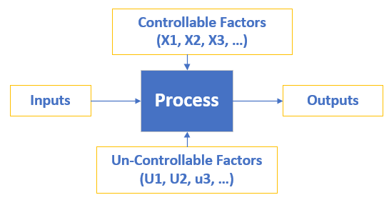

“Give me six hours to chop down a tree and I will spend the first four sharpening the ax.”  ~ Abraham Lincoln 


ref: Kamal Kumar. https://datascienceplus.com/six-sigma-dmaic-series-in-r-part-1/. Accessed on 2/28/2019


# (I) Load Required Libraries

```{r setup, include=FALSE}
knitr::opts_chunk$set(echo = TRUE)

# (b) Load libraries
library(tidyverse)
library(SixSigma)
library(broom)

library(magrittr)
library(qcc)

```

# 1. Define Phase and Tools

DMAIC: Define, Measure, Analyze, Improve, Control. 

```{r}

```

## 1.1 Define Phase

The goal of Define phase is to define project goal and deliverable. 

* Developing a problem statement

* Identifying objectives, resources adn project milestones

Several main tools in the define phase are: 

* Process map

* Cause and effect diagram

* Pareto chart

* Quality Loss Function


## 1.2 Process Map

In general, there are 2 types of maps in Six Sigma Project: SIPOC and VSM.

* SIPOC stands for Supplier, Input, Process, Output, Customer ( from Supplier to Customer)

* VSM stands for Value Stream Map. It not only shows the flow of process but also shows which step is adding value to the process and which is a bottleneck.

Example: Create a process map for making and serving Pizza. 


```{r}
# Create vector of Input , Output and Steps  
inputs <- c("Ingredients", "Cook", "Oven")
outputs <- c("temperature", "taste", "tenderness","weight", "radius", "time")
steps <- c("DOUGH", "TOPPINGS", "BAKE", "DELIVER")

#Save the names of the outputs of each step in lists 
io <- list()
io[[1]] <- list("X's")
io[[2]] <- list("Dough", "ingredients", "Cooker")
io[[3]] <- list("Raw Pizza", "Cooker", "Oven Plate")
io[[4]] <- list("Baked Pizza", "Plate")

#Save the names, parameter types, and features:
param <- list()
param[[1]] <- list(c("Cook", "C"), c("flour brand", "C"), c("prop Water", "P"))
param[[2]] <- list(c("Cook", "C"), c("Ing.Brand", "Cr"), c("amount", "P"), c("prep.Time", "Cr"))
param[[3]] <- list(c("Cook", "C"), c("queue", "N"), c("BakeTime", "Cr"))
param[[4]] <- list(c("Waiter", "C"), c("queue", "N"))

feat <- list()
feat[[1]] <- list("Density", "toughness", "thickness")
feat[[2]] <- list("Diameter", "Weight", "thickness")
feat[[3]] <- list("temperature", "tenderness", "taste")
feat[[4]] <- list("temperature", "taste", "tenderness", "weight", "time")

# Create process map
ss.pMap(steps = steps, 
        inputs.overall = inputs, 
        outputs.overall = outputs,
        input.output = io, 
        x.parameters = param, 
        y.features = feat,
        sub = "Pizza Process Example")
```

## 1.3 Cause and Effect Diagram 

Cause and Effect (a.k.a. Fishbone) Diagram is an efficient way to capture different ideas and stimulate the team’s brainstorming on root causes. It identifies many possible causes for an effect or problem. It helps in following ways:

* Identify possible causes for an effect or problem.

* Effective Brainstorming as it records most of the possible causes of the problem.

```{r}
# Cause and Effect Diagram
##Create effect as string
effect <- "Low Quality Product"

##Create vector of causes
causes.gr <- c("Measurement", 
               "Material", 
               "Methods", 
               "Environment", 
               "Manpower", 
               "Machines")

# Create indiviual cause as vector of list
causes <- vector(mode = "list", length = length(causes.gr))
causes[1] <- list(c("Lab error", "Contamination"))
causes[2] <- list(c("Raw Material", "Additive"))
causes[3] <- list(c("Sampling", "Analytical Procedure"))
causes[4] <- list(c("Rust near sample point"))
causes[5] <- list(c("Poor analyst","No guidance"))
causes[6] <- list(c("Leakage", "breakdown"))

# Create Cause and Effect Diagram
ss.ceDiag(effect = effect, 
          causes.gr = causes.gr, 
          causes = causes, 
          main = "Six Sigma Cause-and-Effect Diagram", 
          sub = "Fish Bone Diagram Example")
```

## 1.4 Pareto Chart

"A Pareto chart is a type of chart that contains both bars and a line graph, where individual values are represented in descending order by bars, and the cumulative total is represented by the line. In this way, the chart visually depicts which situations are more significant. The Pareto Principle states that 20% of all potential projects will produce 80% of the potential benefits to the business.

It helps in following ways:

* Identifying which problem is more important and needs our attention.

* Effective use of resources, as It’s better to have five projects in the 20% high-impact category than thirty projects spread across the payback spectrum. "

```{r}
#Pareto Chart
library(qcc)

# 6 type of defects  and the number of defacts of each defact
defect <- c(60,20,16,14,8,9)
names(defect) <- c("A", "B", "C", "D","E","F")

pareto.chart(data = defect, 
             ylab = "Defect frequency", 
             col = heat.colors(length(defect)))
```

## 1.5 Loss Function Analysis 

"Since there are only a few features of a product that is critical to Quality (CTQ) or important to the customer. So in order to meet that customer expectation, the process should be correct. In Six Sigma professionals language: high-quality processes lead automatically to high-quality products. The cost of poor quality will result in a quantifiable loss for the organization. This loss can be modeled by a function. Its called quality loss function introduced by Taguchi, to calculate the average loss of a process. When the CTQ characteristic lies outside of the specification limits, that is, quality is poor, the company incurs a cost that obviously must be calculated."

### 1.5.1 Modeling the Loss Function

The CTQ characteristic is represented by Y, and the loss function provides a number  indicating the value of the cost in monetary units. 

The target value of the CTQ characteristic is denoted by $Y_0$ and the tolerance by $\Delta$. The cost of poor quality at $Y = Y_0 + \Delta$ be $L_0$: 
$$L_0 = L(Y_0 + \Delta)$$

### 1.5.2 Taguchi Loss Function

The loss function is related to the distance from the target: 

$$L(Y) = k(Y - Y_0)^2$$

The function has the following properties: 

* *Loss = 0*, when the observed value equals to the target

* *Loss* increases when the observed value moves away from the target

* *k*: indicative of the risk of having more variation


**Example**: 

```{r}
# The target of the diameter of the bolts
Y0 <- 10 

# accept the range
Delta <- 0.5
LSL <- Y0 - 0.5
USL <- Y0 + 0.5

# the cost at Yo + Delta
L0 <- 0.001 

# calculate k
k <- L0/Delta

# Define the loss function
L_Y <- function(Y) {
  k * (Y - Y0)^2
}

# Plot
data.frame(x = seq(from = 9, to = 11, by = 0.01)) %>%
  ggplot(aes(x)) +
  stat_function(fun = L_Y) + 
  geom_vline(xintercept = c(LSL, Y0, USL), linetype = "dashed", color = "red") + 
  labs(x = "Observed value of the characteristic", 
       y = "Cost of Poor Quality") +
  theme_classic()

```

The above example, the quality loss function is for a single item. However, the objective of the loss function analysis is to calculate the cost of poor quality for a process over a period of time. Therefore, if we have n elements in a period or set of items, the average loss per unit (L) is obtained by averaging the invidual losses. 

$$L = \frac{\sum_{i = 0}^{n} (Y_i - Y_0)^2)}{n} = k \frac{\sum_{i=0}^{n}(Y_i - Y_0)^2}{n}$$

The second factor is the mean squared deviation (MSD). Hence, the average loss per unit in a given sample (period, batch, ...) is simply expressed by L = k(MSD). 

```{r}
# Create loss function with Tolerance=0.5 ,target=10, Cost of poor quality = 0.001,batch size=100000)
ss.lfa(lfa.data = ss.data.bolts, 
       lfa.ctq = "diameter", 
       lfa.Delta = 0.5, 
       lfa.Y0 = 10, 
       lfa.L0 = 0.001,
       lfa.sub = "Bolts example loss function",
       lfa.size = 100000, 
       lfa.output = "both")
```

Quality loss function helps in Define phase in a way where you can say that you are loosing on quality because of variance in the process, that's why you need to initiate the project. 


**Summary**: 

* Process map: help to understand the process 

* Cause & Effect diagram: identify possible root cause for a problem 

* Pareto: select high payback projects to work on

* Quality loss function: know your quality loss 


# 2. Measure Phase and Tools

* Determine the baseline and target performance of the process

* Validate the measurment systems

Two most representative tools during measure phase are: 

* (1) Measurement system analysis

* (2) Process capability analysis


## 2.1 Measurement system analysis

Today, many companies collect a large amount of data through measurement and inspection. We make decisions about process based on the measurment data, so the measurement data must be accurate. As any processes, teh measurements have variation. 

Some projects, measurement system variation accounted for most of the variation in the CTQ. If we can not control the variability of measurement sytem, the process can not be controlled. 

Gage R&$ quantify three things: 

* repeatability: variation from the measurement instrument

* Reproducibility: varation form the individuals using the instrument

* Overal Gage R&R (repeatability + reproducibility) 


## 2.2 Data Collection for Gage R&R study

### 2.2.1 Data Collection and summary 

Randomly select the parts and assign them to the appraisers or operators or meters again randomly. 

```{r}
# Create gage R and R data for 3 piston rings , 2 operators and each operator 3 measurements per piston
Operator <- factor(rep(1:2, each = 9))
Pistonring <- factor(rep(rep(1:3, each = 3), 2))
run <- factor(rep(1:3, 6))
diameter <- c(1.4727, 1.4206, 1.4754, 1.5083, 1.5739,
               1.4341, 1.5517, 1.5483, 1.4614, 1.3337,
               1.6078, 1.4767, 1.4066, 1.5951, 1.8419,
               1.7087, 1.8259, 1.5444)

pistondata <- data.frame(Operator, Pistonring, run, diameter)

head(pistondata)

# plot
pistondata %>%
  ggplot(aes(x = Pistonring, y = diameter, color = Operator)) +
  geom_point()

# summary
pistondata %>%
  group_by(Pistonring, Operator) %>%
  summarize(mean = mean(diameter), 
            sd = sd(diameter))
```


### 2.2.2 Perform Gage R&R in R 

```{r}
# Perform gage R&R
my.rr <- ss.rr(var = diameter, 
               part = Pistonring, 
               appr = Operator, 
               data = pistondata, 
               main = "Six Sigma Gage R&R Measure", 
               sub = "Piston ring MSA")

# try to calcuate some 
pistondata %>%
  summarize(
    n = n(), 
    var = var(diameter), 
    var_my = sum((diameter - mean(diameter))^2)/(n - 1), 
    total_sum_sq = sum((diameter - mean(diameter))^2))

# Run a mixed model 
lmer_model <- lmerTest::lmer(diameter ~ (1|Pistonring) + (1|Operator) ,
                   data = pistondata)

lmer_model
lme4::fixef(lmer_model)
lme4::ranef(lmer_model)
```


### 2.2.3 Interpretation of Charts

* Bar plot shows contribution of each component to the total variance. 

* Strip plots and line plots respresenting the effects. Interaction plot, as lines do not cress each other, so interaction beween factors is irrelevent. 

* Control charts (X-bar and R chart): Several points in the range control chart lie outside the limits, which indicates that the measurement system is not working properly. However, all the points are within control limits in the X-bar chart. 


## 2.3 Process Capability analysis

Capability analysis is a very important tool in Measure phase. Since the output of a process is expected to meet customer requirements, specifications, or engineering tolerances. You can conduct a process capability study to determine the extent to which the process can meet these expectations.

The process capability is a measurable property of a process to the specification, expressed as Process capability Index Cpk.

Let’s create data for Process capability analysis in R. Let’s say you have 20 food samples with calories values.

```{r}
# Create data for Process capability analysis
foodsample <- c(755.81, 750.54, 751.05, 749.52, 749.21, 748.38,
     748.11, 753.07, 749.56, 750.08, 747.16, 747.53,
     749.22, 746.76, 747.64, 750.46, 749.27, 750.33,
     750.26, 751.29)

foodsample2 <- as.data.frame(foodsample)

foodsample2 %>%
  ggplot(aes(x = foodsample)) + 
  geom_density()
```


## 2.4 Cp and CpK 

Cp is a measure of process capability that compares the specification width (USL – LSL) to the total process variation (6σ) for a given process or product parameter. The higher the Cp value, the more potential a process has to fit inside specification limits. The equation for Cp is Cp= (USL-LSL)/(6σ)

Cpk is very useful because it takes variation (σ) and position (X̄) into account versus upper and lower specification limits. If the mean is closer to the upper specification limit (USL), then Cpk is (USL-X̄)/(3σ). If the mean is closer to the lower specification limit (LSL), Cpk is (X̄ – USL)/(3σ)

For a perfectly centered process, Cp = Cpk

```{r}
# calculate Cp and CpK 
ss.ca.cp(foodsample, 
         LSL = 740, 
         USL = 760)

ss.ca.cpk(foodsample, 
         LSL = 740, 
         USL = 760)

# Calculate confidence intervals
ss.ca.cp(foodsample, LSL = 740, USL = 760, ci = TRUE)
ss.ca.cpk(foodsample, LSL = 740, USL = 760, ci = TRUE)
```

### 2.4.1 Capability study

Full capability study with graphical output
```{r}
# Perform Capability study
ss.study.ca(xST = foodsample, 
            LSL = 740, 
            USL = 760, 
            Target = 750, 
            alpha = 0.5, 
            f.sub = "Food Sample Example")
```

###  2.4.2 Interpretation of Plot

* The top chart is a histogram of the sample data, which includes the target and the specification limits. Density lines are plotted for the empirical and theoretical density functions.

* The bottom chart is a quantile-quantile chart (Q–Q plot) to verify if the data are normally distributed. When they are, the points are approximately on a straight line. 

* The process performance and the indices are calculated with the short-term and long-term data provided. For long-term data, it also shows Pp and Ppk values. In this example, we have no long-term data. Capability index (1.547) is quite acceptable, though it can be improved to reach the desired 1.67 value ( for 6 sigma process).


# 3. Analyze Phase and Tools 

* Charts in R

* Hypothesis Testing in R

## 3.1 Charts in R

### 3.1.1 Bar Chart 

A bar chart is usually a good graphical representation for counts. 

```{r}
ss.data.pc.r %>%
  ggplot(aes(x = pc.regions)) + 
  geom_bar(aes(weight = pc.def)) + 
  labs(title = "Barplot of defects by region", subtitle = "Printer cartridge example")
```

### 3.1.2 Histogram 

```{r}
ss.data.pc %>%
  ggplot(aes(x = pc.volume)) +
  geom_histogram(aes(y = ..density..), bins = 6, color = "grey") + 
  geom_density(lwd = 1, color = "red", alpha = 0.5) +
  stat_function(fun = dnorm, args = list(mean = 16, sd = 1), lty = 2, lwd = 1, color = "green")
  labs(title = "Printer Cartridge Volume", x = "Volume")
```

### 3.1.3 Scatterplot 

```{r}
ss.data.pc %>%
  ggplot(aes(x = pc.volume, y = pc.density)) + 
  geom_point()
```

### 3.1.4 Boxplot

```{r}
ss.data.pc %>%
  ggplot(aes(x = pc.filler, y = pc.volume, fill = pc.filler), alpha = 0.5) + 
  geom_boxplot() + 
  stat_boxplot(geom = 'errorbar', width = 0.5, alpha = 0.5) 
```


## 3.2 Hypothesis Testing 


R functions: 

* *t.test*: for means

* *prop.test*: proportions

* *var.test* and *bartlett.test*: variances

* *chisq.test*: contingency table 

* *goodness-of-fit*: test

* *poisson.test*: poisson distribution

* *binom.test*: binomial distribution

* *shapiro.test*: normality tests

### 3.2.1 t.test
Example: Hypothesis test to verify if the length of the strings is different from the target value of 950 mm:

```{r}
# One sample t-test
t.test(x = ss.data.strings$len, 
       mu = 950, 
       conf.level = 0.95)

# Two samples t-test
data.E1 <- ss.data.strings$len[ss.data.strings$type == "E1"]
data.E6 <- ss.data.strings$len[ss.data.strings$type == "E6"]
t.test(data.E1, data.E6)

ss.data.strings %>%
  filter(type %in% c("E1", "E6")) %>%
  lm(len ~ type, data = .) %>%
  tidy()

ss.data.strings %>%
  filter(type %in% c("E1", "E6")) %>%
  t.test(len ~ type, data = .)
```

### 3.2.2 Comparing variances 

```{r}
ss.data.strings %>%
  filter(type %in% c("E1", "E6")) %>%
  var.test(len ~ type, data = .)

```


### 3.2.3 Comparing proportions 

prop.test can be used for testing the null that the proportions (probabilities of success) in several groups are the same, or that they equal certain given values.

```{r}
# method 1
defects <- data.frame(type = ss.data.strings$type, res = ss.data.strings$res < 3)

defects <- aggregate(formula = res ~ type, 
                     data = defects, 
                     FUN = sum)

prop.test(
  # a vector of counts of successes
  x = defects$res, 
  # a vector of counts of trials
  n = rep(20,6))

# method 2 
ss.data.strings %>%
  group_by(type) %>%
  summarize(n = n(), 
            n_res_lt3 = sum(res < 3)) %$%       # magrittr %$%: "explodeds" out the variables
  prop.test(x = n_res_lt3, n = n)


# other example 

# random generation for the binomial distribution with parameters size and prob
heads <- rbinom(n = 1, size = 100, prob = .5)


prop.test(x = heads, n = 100)          # continuity correction TRUE by default
prop.test(x = heads, n = 100, correct = FALSE)

## Data from Fleiss (1981), p. 139.
## H0: The null hypothesis is that the four populations from which
##     the patients were drawn have the same true proportion of smokers.
## A:  The alternative is that this proportion is different in at
##     least one of the populations.

smokers  <- c( 83, 90, 129, 70 )
patients <- c( 86, 93, 136, 82 )
prop.test(x = smokers, 
          n = patients, correct = TRUE)


# Tidy way to do it
data.frame(smokers  = c( 83, 90, 129, 70 ), 
           patients = c( 86, 93, 136, 82 )) %$%
  prop.test(x = smokers, 
            n = patients)

```

### 3.2.4 Normality test
```{r}
# Shapiro-Wilk Normality Test
ss.data.strings %$%
  shapiro.test(len)

# example 2
shapiro.test(x = rnorm(100, mean = 5, sd = 3))
shapiro.test(x = runif(100, min = 2, max = 4))
```

p-value = 0.19 > 0.05, thy null hypothesis of normality can not be rejected. 


### 3.2.5 Power and sample size

A type I error occurs when we reject the null hypothesis and it is true. We commit a type II error when we do not reject the null hypothesis and it is false. The probability of the former is represented as α, and it is the significance level of the hypothesis test (1 − α is the confidence level). The probability of the latter is represented as β, and the value 1−β is the statistical power of the test.

The R functions *power.prop.test* and *power.t.test* can be used to determine the power or the sample size.


Example: Black belt plan to perform a new analysis to find out the sample size needed to estimate the mean length of the strings with a maximum error of δ = 0.1 cm. He sets the significance level (α = 0.05) and the power (1−β = 0.90). The sample size can be determined using the following command:


```{r}
# manual mehtod (may not be perfect)
sd <- sd(ss.data.strings$len)
delta <- 0.1 
n <- ceiling((2*sd/delta)^2) %>% print

# use power.t.test: Power calculation for one and two sample t-tests
# compute the power of the one- or two-sample test, or determine paramters to obtain a target power
power.t.test(
  # true difference in means
  delta = 0.1, 
  # standard deviation
  sd = sd(ss.data.strings$len),
  # significance level (Type I error probability)
  sig.level = 0.05, 
  # Power of test (1 - Type II error probability)
  power = 0.9)


# What is power of test with only 3 sample 
power.t.test(n = 3, 
             delta = 0.1, 
             sd = sd(ss.data.strings$len), 
             sig.level = 0.05)
```

# 4. Design of experiment (DOE) 

Proper design can lead to process improvement and reveal new insight. However, a bad design of experiment can lead to undesired results, or even mislead the reseach effort. 

```{r}

```


## 4.1 Characteristics of Well Planned Experiments

* The degree of precision: Probability shoudl be high that experiment can measure the differences. Appropriate design and replication. 
* Simplicity: with objectives of experiment, as simple as possible. 

* No system error: treatment is not systemtaic different from control

* Range of validility

* Calculatin of the degree of Uncertainty:  results are not got by chance along. 


## 4.2 Three basic principle of experiments

* Randomization

* Repetition

* Blocking 


Example: 

Determine the optimal levels of the three main ingredients in the pizza dough: flour, salt, and baking powder. 

```{r}
# Create a data frame from all combinations of factor variables
pizza_design <- expand.grid(flour = gl(n = 2, k = 1, labels = c("-", "+")), 
                            salt  = gl(n = 2, k = 1, labels = c("-", "+")), 
                            bakPow = gl(n = 2, k = 1, labels = c("-", "+")), 
                            score = NA)

pizza_design


# another example
# expand.grid(height = seq(60, 80, 5), 
#             weight = seq(100, 300, 50), 
#             sex = c("Male", "Female"))  

# Randomization
pizza_design$ord <- sample(1:8, 8)

pizza_design[order(pizza_design$ord), ]

```

## 4.3 Linear model and ANOVA
### 4.3.1 data and plot 
```{r}
# add replicates 
ss.data.doe1 <- data.frame(repl = rep(1:2, each = 8), 
                           rbind(pizza_design, pizza_design)) 

# fill in "score"
ss.data.doe1$score <- c(5.33, 6.99, 4.23, 6.61, 2.26, 5.75, 3.26, 6.24, 
                        5.70, 7.71, 5.13, 6.76, 2.79, 4.57, 2.48, 6.18)

# summary 
ss.data.doe1 %>%
  group_by(flour, salt, bakPow) %>%
  summarise(mean_score = mean(score), 
            sd_score = sd(score))


# plot
ss.data.doe1 %>%
  ggplot(aes(x = flour, y = score, color = bakPow)) + 
  geom_point()  +
  geom_line(aes(group = bakPow)) + 
  geom_hline(yintercept = mean(ss.data.doe1$score), 
             linetype = "dashed", 
             color = "blue")

```

### 4.3.2 Linear model and ANOVA test

```{r}
# build  a linear model
lm_model <- lm(score ~ flour * salt * bakPow, data = ss.data.doe1)

# summary 
summary(lm_model)

anova(lm_model)

# Simplify the model
lm_model_simple <- lm(score ~ flour + bakPow, data = ss.data.doe1)
summary(lm_model_simple)
anova(lm_model_simple)

# prediction 
predict(lm_model_simple)
```

### 4.3.3 Residual normality test
```{r}
shapiro.test(residuals(lm_model_simple))
```

# 5. Control Phase and Tools 

The aim of the control phase is to sustain the improvements achieved through the other stages of DMAIC cycle. 

During the analyze phase, once vital few X's (variables that cause the variation in Ys of the process). If the variability of the Xs is under good control, then the process will perform correctly, leading to the required Ys and, therefore, high-quality products. 

## 5.1 Control Chart Selection 

Two causes to the variation of the process: 

* Common cause: inherent in the process and no external factor can be associated with it. 

* Special cause: factors that are not a part of the process or system. 

The use of a control chart is to distinguish between a common cuase and a special cause. 


```{r}

```

## 5.2 Variable Control Charts in R

**qcc** package will be used here, by first creating the qcc objects. 

```{r}
# data set: humidity for each lot
head(ss.data.pb1)
summary(ss.data.pb1)

plot(ss.data.pb1$pb.humidity)


# Grouping data based on a sample indicator: Evaluate an expression in a data environment
pb.groups.one <- with(ss.data.pb1, 
     qcc.groups(data = pb.humidity,
                sample = pb.group))

# another way 
pb.groups.one <- ss.data.pb1 %$%
  qcc.groups(data = pb.humidity,
             sample = pb.group)

str(pb.groups.one)


# Quality Control Charts: create an object of class 'qcc' to perform statistical quality control. Then it can be used plot Shewhart charts, drawing OC curves, compute capability indices, ...
pb.xbar.one <- qcc(pb.groups.one, type = "xbar.one")

summary(pb.xbar.one)

# Individual control chart- X-bar
plot(pb.xbar.one)

```


## 5.3 Attribute Control Charts in R

Attribute control charts is for monitoring qualitative variables. 

```{r}
# Particle Boards Example - Attribute data
# Counts of raw materials stockouts during 22 weekdays in a month
head(ss.data.pb3)
summary(ss.data.pb3)

# qcc
qcc_p_chart <- ss.data.pb3 %$%
  qcc(stockouts, orders, type = "p")

summary(qcc_p_chart)
```


## 5.4 Cusum chart for statistical quality control.

```{r}
# data
data(pistonrings)
head(pistonrings)

# plot
pistonrings %>%
  ggplot(aes(x = sample, y = diameter), color = trial) +
  geom_point() + 
  geom_line(aes(group = sample))

# group data 
diameter <- pistonrings %$% qcc.groups(diameter, sample)

head(diameter)

# create a cusum plot 
q <- cusum(diameter[1:25,], 
           decision.interval = 4, 
           se.shift = 1)
summary(q)

# cusum plot for new data 
q <- cusum(diameter[1:25,], 
           newdata = diameter[26:40,])

summary(q)

plot(q, chart.all = FALSE)
```