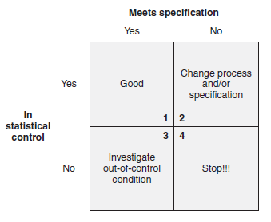

“Give me six hours to chop down a tree and I will spend the first four sharpening the ax.”  ~ Abraham Lincoln 


**Course Description**

"" 


ref: University System of Georgia. https://www.coursera.org/learn/six-sigma-define-measure-advanced/home/welcome


# (I) Load Required Libraries

```{r setup, include=FALSE}
knitr::opts_chunk$set(echo = TRUE)

# (b) Load libraries
library(tidyverse)
library(NHANES)
library(infer)
```


# 1. Week 1 

## 1.1 Reading

The Certified Six Sigma Green Belt Handbook (2nd ed): 

## 1.2 The Importance of Teams in Quality Improvement

We all have certain skills and abilities. Working on a team allows you to collaborate with others who have different skills and abilities and knowledge. A key characteristic of high-performing organizations is their tendency to work in teams.

It is natural for individuals to resist change. However when you're are involved in solving a problem or improving a process, they develop a sense of ownership. It's important to not jump quickly to solutions. Teams need time to understand the history of a problem. If you keep fooling with the process you introduce additional variation and improvement becomes a moving target. That's called tampering. 

The people we need to understand include the team, and others involved in the process, but also other stakeholders. That includes anyone who may be affected by changes either positively or negatively. At the beginning of an improvement project, it's good to brainstorm who the various stakeholders are. And how you will listen to their concerns and relay information to them.

**Stages of Team Growth:**

* Forming - pride in being chose; excitement, anticipation, optimism; initial, tentiative attachment ot team; suspicion, fear, anxiety. 

* Storming - Frustrating and resistance to tasks and different work methods; Sharp fluctuations in attitude; Anxiety 

* Norming - Sense of cohesion, common spirit and goals; acceptance of team membership; raise differences of opinions effectively

* Performing - understanding each other's strengths and weaknesses; creating constructive self-change

* Adjourning - Reflection, celebration. 


## 1.3 Brainstorming and Team Decision Tools 

Purpose of brainstorming is to collect as many ideas as possible; Several of the other tools, like cause and effect, and Why, Why, Why are specialized brainstorming tools. 

Affinity diagram

List reduction 

Prioritization 

*Agendas, Minutes & Status Reports*

Managing meetings:  Purpose, Agenda, Minutes, Status reports. 

Roles: meeting leader, facilitator, time keeper, scribe

Preparing the Agenda: 


# 2. Week 2: Process Analysis and Documentation

In this module you will learn the application of process maps and flow charts swim lane. You will also about the application of: written procedures and works instructions, CEDAC, the Pareto diagram, and the relationship matrix.

**Learning Objectives**

* Identify and Explain the application of Process Maps and Flow Charts Swim Lane

* Identify and Explain the application of written procedures and work instructions

* Identify and Explain the application of CEDAC

* Identify and Explain the application of the Pareto diagram

* Identify and Explain the application of the relationship matrix


Read pages 153-158 in The Six Sigma Green Belt Handbook (2nd ed) and then view the lecture videos to learn more about Process Maps and Flow Charts.

Chapter 10: 

A. Process Analysis and Documentation

Develop process maps and review written procedures, work instructions, and flowcharts to identify any gaps or areas of the process that are misaligned. 


## 2.1 Process Mapping 


# 11 B. Probability and Statistics (Week 3)

"Identify and use basic probability concepts: independent events, mutally exclusive events, multiplication rules, permulations and combinations." (Apply). Body of Knowledge III.B.1


# (Week 5-Statistical Distribution)

# 15. F. Process and Performance Capability

## 15.1  Process Performance vs. Process specifications 

Need to know: Define and distinguish between natural process limits and spcification limits, and calculate process performance metrics (Evaluate). Body of Knowledge III. F.1


*Natural process limits* are calculated from process variation. This is done after all special causes have been removed and the process has achieved statistical stability. 

*Specifications*, on the other hand, are expectations from the engineering or customer point of view. 

When the process variation is significantly lower than the width of the specification (upper limit - lower limit), then we call the process a *capable* process. 

```{r}

```

First quadrant. If the process is in a state of statistical control (within natural process control limits and follows other applicable rules) and meets specification, the situation is "good". 

Fourth quadrant. If the process is not in a state of statistical control and does not meet specification, the Green Belt should stop the process and immediately investigate. 

Many people ofter get confused between natural process limits (NPL) and specification limits. Many who are in the third quadrant scenario may even argue that they donot need to worry as they are producing products that meet specification. *Out-of-control* situations cause lack of predictability in the process. Once a process is unpredictable, the process may go out of spec at any time. 

*Variation should be in control before making adjustment to average.*


# 21. A. Statistical Process Control (SPC)

Need to know: Describe the theory and objectives of SPC, including measuring and monitoring process performance for both continuous and discrete data. Define and distinguish between common and special cause variation adn how these conditions can be deduced form control chart analysis. (Analyze) 


The purpose of SPC is to apply this information constructively toward building and adapting processes, documenting procedures, and maintaining gains realized from successful improvement initiatives. It can be used as a baseline on which future improvements can be made. 


# 22. B. Control Plan

# 23. C. Lean Tools for Process Control


